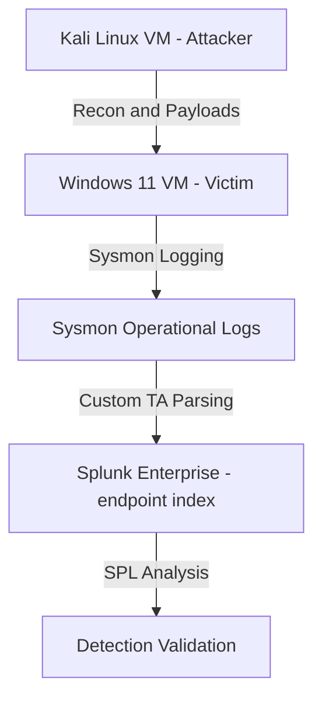

# 📥 Part 5: SIEM Ingestion (Splunk)

This phase focuses on **ingesting endpoint telemetry into Splunk** so that all attacker activity and system events are searchable, normalized, and ready for analysis.

The goal is to move from *“logs exist on the endpoint”* to *“events are parsed and queryable in Splunk.”*

---

## 🛠️ Data Sources

Telemetry ingested includes:

| Source | Description |
|--------|-------------|
| Windows Event Logs | Default application, system, and security logs |
| Sysmon Operational Logs | High-fidelity process, network, file, and registry events collected via Sysmon with Olaf Hartong configuration |

---

## 🔧 Splunk Setup

- Installed **Splunk Enterprise** on the Windows endpoint (port `8000`)  
- Custom Sysmon **Technical Add-on (TA)** used for XML parsing and field flattening  
- Created an Index to use for all telemetry: `endpoint`  
- Verified ingestion via Splunk Web search interface (`http://192.168.20.10:8000`)  
- License fully operational, no ingestion delays observed  

**Notes:**

- No universal forwarder or heavy forwarder was configured due to time constraints.  
- Parsing relied entirely on the custom TA for field extraction.

---

## ❌ Issues Encountered

1. **Events not appearing immediately in searches**  
   - **Cause:** Raw Sysmon XML was ingested, fields were nested  
   - **Fix:** Custom TA configured with `KV_MODE=xml`, field aliases, and transforms for flattening  

2. **Incorrect or missing sourcetype**  
   - **Cause:** Default Windows Event Log source used instead of `XmlWinEventLog:Microsoft-Windows-Sysmon/Operational`  
   - **Fix:** Explicitly configured sourcetype in `inputs.conf` and matched in `props.conf`  

3. **Index misassignment**  
   - **Cause:** Events initially pointed to the default index  
   - **Fix:** Updated inputs to route Sysmon events to `endpoint` index

---

## ✅ Outcome

After applying the fixes:

- Sysmon events were **visible in Splunk Web**  
- Fields flattened and aliased correctly, including:
  - `process_exec`, `parent_process_exec`, `command_line`  
  - `src_ip`, `src_port`, `dest_ip`, `dest_port`  
  - `user`, `security_userid`  
- Events became **fully searchable and filterable** using SPL  

Example SPL queries:

```spl
# View all process creations with parent-child relationships
index=endpoint source="XmlWinEventLog:Microsoft-Windows-Sysmon/Operational"
| table _time parent_process_exec process_exec command_line user

# View all network connections
index=endpoint source="XmlWinEventLog:Microsoft-Windows-Sysmon/Operational" EventCode=3
| table _time process_exec src_ip src_port dest_ip dest_port

# Count process creation events by user
index=endpoint source="XmlWinEventLog:Microsoft-Windows-Sysmon/Operational" EventCode=1
| stats count by user process_exec
```

---

# 📥 Part 5: SIEM Ingestion (Splunk)

This phase focuses on **ingesting endpoint telemetry into Splunk** so that all attacker activity and system events are searchable, normalized, and ready for analysis.

The goal is to move from *“logs exist on the endpoint”* to *“events are parsed and queryable in Splunk.”*

---

## 🛠️ Data Sources

Telemetry ingested includes:

| Source | Description |
|--------|-------------|
| Windows Event Logs | Default application, system, and security logs |
| Sysmon Operational Logs | High-fidelity process, network, file, and registry events collected via Sysmon with Olaf Hartong configuration |

---

## 🔧 Splunk Setup

- Installed **Splunk Enterprise** on the Windows endpoint (port `8000`)  
- Custom Sysmon **Technical Add-on (TA)** used for XML parsing and field flattening  
- Index used for all telemetry: `endpoint`  
- Verified ingestion via Splunk Web search interface (`http://<windows_ip>:8000`)  
- License fully operational, no ingestion delays observed  

**Notes:**

- No universal forwarder or heavy forwarder was configured due to time constraints.  
- Parsing relied entirely on the custom TA for field extraction.

---

## ❌ Issues Encountered

1. **Events not appearing immediately in searches**  
   - **Cause:** Raw Sysmon XML was ingested, fields were nested  
   - **Fix:** Custom TA configured with `KV_MODE=xml`, field aliases, and transforms for flattening  

2. **Incorrect or missing sourcetype**  
   - **Cause:** Default Windows Event Log source used instead of `XmlWinEventLog:Microsoft-Windows-Sysmon/Operational`  
   - **Fix:** Explicitly configured sourcetype in `inputs.conf` and matched in `props.conf`  

3. **Index misassignment**  
   - **Cause:** Events initially pointed to the default index  
   - **Fix:** Updated inputs to route Sysmon events to `endpoint` index

---

## ✅ Outcome

After applying the fixes:

- Sysmon events were **visible in Splunk Web**  
- Fields flattened and aliased correctly, including:
  - `process_exec`, `parent_process_exec`, `command_line`  
  - `src_ip`, `src_port`, `dest_ip`, `dest_port`  
  - `user`, `security_userid`  
- Events became **fully searchable and filterable** using SPL  

Example SPL queries:

# View all process creations with parent-child relationships
```spl
index=endpoint source="XmlWinEventLog:Microsoft-Windows-Sysmon/Operational"
| table _time parent_process_exec process_exec command_line user
```

# View all network connections
```spl
index=endpoint source="XmlWinEventLog:Microsoft-Windows-Sysmon/Operational" EventCode=3
| table _time process_exec src_ip src_port dest_ip dest_port
```

# Count process creation events by user
```spl
index=endpoint source="XmlWinEventLog:Microsoft-Windows-Sysmon/Operational" EventCode=1
| stats count by user process_exec
```

## 🧯 Lessons Learned

- Sysmon logs must be parsed to be actionable, raw XML is unusable for detection.

- Sourcetype and index configuration are critical for proper event visibility.

- A custom TA can simplify ingestion, especially in small labs or isolated environments.

- Even without a universal forwarder, local Splunk Enterprise can ingest logs successfully.

- License validity and system performance directly affect ingestion speed and search reliability.

---

## 🖼️ Telemetry Flow Diagram

#### ⚠ For the full lab data flow diagram, check out <a href="https://github.com/Volpezer0x/Detection-Lab/blob/main/architecture.md"> Archetecture.md
